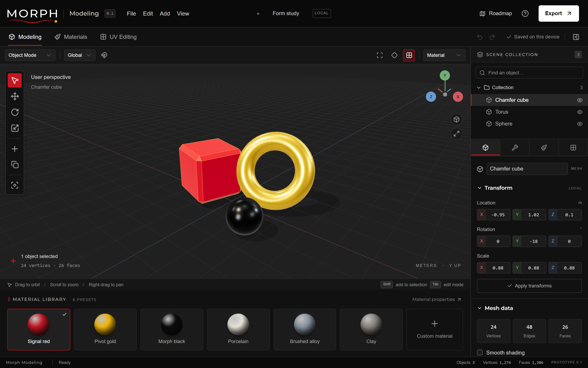

<div align="center">

<picture>
  <source media="(prefers-color-scheme: dark)" srcset="docs/images/morph-wordmark-dark.svg">
  
</picture>

# Morph Modeling

**Browser-based 3D modeling, materials and UV editing.**
Local-first, with no install, account or server.

[](https://github.com/ItzMorphineTime/MorphModelling/actions/workflows/deploy.yml)
[](https://itzmorphinetime.github.io/MorphModelling/)

</div>



## Overview

Morph Modeling is a web-based 3D editor inspired by Blender. It covers the path from primitive creation through polygon editing, PBR materials and UV layout to portable export, entirely in the browser. Projects never leave your device: work is recovered locally, and you can save a portable `.morph` file at any time.

This is **prototype 0.1**, a focused engineering prototype rather than a complete Blender replacement. See the [roadmap](public/ROADMAP.md) for what is implemented, the known limits and the planned milestones.

## Features

| Area | What you can do |
| --- | --- |
| **Scene** | Add cubes, planes, spheres, cylinders, cones, tori and icospheres; organise them in an outliner with names, visibility and multi-selection. |
| **Navigation** | Orbit, pan and zoom; frame the selection; switch between axis views and perspective or orthographic projection. |
| **Transform** | Move, rotate and scale with world or local handles, numeric input and snapping; apply transforms and centre origins. |
| **Mesh editing** | Select vertices, edges or faces; extrude regions, inset, chamfer, subdivide, loop slice, triangulate, fill, weld, merge, mirror and flip normals. |
| **Objects** | Duplicate, delete, join and separate selected faces into a new object. |
| **Materials** | Six presets and a principled PBR material: colour, metalness, roughness, opacity, emission, and base colour, normal and roughness maps. |
| **UV editing** | Box, planar, cylindrical and per-face projection; face packing; move, rotate and scale faces or individual UV corners; export the UV layout as SVG. |
| **Files** | Save and open editable `.morph` projects; import and export GLB, glTF, OBJ and STL. |
| **Safety net** | 35 levels of undo and redo, plus automatic recovery from the browser's local storage. |
| **Rendering** | WebGL 2 PBR with studio lighting, shadows, and material, solid and wireframe views. Without WebGL, an SVG compatibility viewport keeps modeling available. |

## Getting started

You need [Node.js](https://nodejs.org/) 22.13 or newer, which includes npm.

```bash
git clone https://github.com/ItzMorphineTime/MorphModelling.git
cd MorphModelling
npm install
npm run dev
```

Then open <http://localhost:5173>. The editor reloads as you change the source.

To run the production build locally:

```bash
npm run build
npm run preview
```

> [!NOTE]
> Open the built app through a web server such as `npm run preview`. Browsers block the app's JavaScript modules when `dist/index.html` is opened directly from disk.

### Scripts

| Command | Description |
| --- | --- |
| `npm run dev` | Start the development server with hot reload. |
| `npm run build` | Type-check, then build the static site into `dist/`. |
| `npm run preview` | Serve the production build locally. |
| `npm test` | Run the geometry, serialization and file round-trip tests. |
| `npm run typecheck` | Run the TypeScript compiler without emitting files. |
| `npm run lint` | Lint the source with ESLint. |
| `npm run format` | Format the source with Prettier. `npm run format:check` only verifies it. |

## Deployment

The app is a fully static site. It needs no server-side code, environment variables or API keys.

### GitHub Pages

The workflow in [`.github/workflows/deploy.yml`](.github/workflows/deploy.yml) lints, tests and builds every push and pull request, then publishes the `master` branch to GitHub Pages.

To enable it once, open the repository's **Settings → Pages** and set **Source** to **GitHub Actions**. After the next push to `master`, the editor is live at <https://itzmorphinetime.github.io/MorphModelling/>.

### Any static host

`npm run build` writes everything to `dist/`. Asset URLs are relative, so the folder works from a domain root or any sub-path, on hosts such as Netlify, Cloudflare Pages, Amazon S3 or nginx.

## Keyboard shortcuts

| Keys | Action |
| --- | --- |
| <kbd>Tab</kbd> | Switch between Object and Edit Mode |
| <kbd>Q</kbd> <kbd>G</kbd> <kbd>R</kbd> <kbd>S</kbd> | Select, move, rotate, scale |
| <kbd>1</kbd> <kbd>2</kbd> <kbd>3</kbd> | Vertex, edge, face selection (Edit Mode) |
| <kbd>E</kbd> / <kbd>I</kbd> | Extrude / inset selected faces |
| <kbd>A</kbd> | Select all |
| <kbd>Shift</kbd> + <kbd>D</kbd> / <kbd>Delete</kbd> | Duplicate / delete |
| <kbd>F</kbd> / <kbd>Home</kbd> | Frame selection / frame all |
| <kbd>Numpad 1</kbd> <kbd>3</kbd> <kbd>7</kbd> / <kbd>5</kbd> | Front, right, top view / toggle orthographic |
| <kbd>Ctrl</kbd> + <kbd>Z</kbd> / <kbd>Ctrl</kbd> + <kbd>Shift</kbd> + <kbd>Z</kbd> | Undo / redo |
| <kbd>Ctrl</kbd> + <kbd>S</kbd> / <kbd>Ctrl</kbd> + <kbd>O</kbd> | Save / open a project |

The full list is under **Help** (the **?** button) in the editor.

## Project structure

```text
├── .github/workflows/   CI and GitHub Pages deployment
├── docs/                README images and validation notes
├── public/              Static files served as-is: favicons, ROADMAP.md
├── src/
│   ├── assets/brand/    Official Morph logo files used by the interface
│   ├── components/
│   │   ├── morph/       Editor, UV editor, roadmap and help content
│   │   └── ui/          shadcn/ui primitives built on Radix UI
│   ├── lib/morph/
│   │   ├── model.ts     Editable mesh model and geometry operations
│   │   ├── viewport.ts  three.js viewport, picking, cameras and transforms
│   │   ├── files.ts     Import and export, textures and local recovery
│   │   └── theme.ts     Brand colours for the 3D viewport and UV canvas
│   ├── styles/          Design tokens and global styles
│   └── main.tsx         Application entry point
├── tests/               Node.js test runner suites
├── vendor/              Vendored shadcn/ui Tailwind CSS (MIT)
└── index.html           HTML entry point
```

The editor is a React and TypeScript single-page app built with [Vite](https://vite.dev/). Geometry lives in plain, serializable polygon meshes with per-corner UVs (`model.ts`), which the viewport converts to three.js geometry for rendering and picking.

## Brand

The interface follows the Morph Brand System V2.1 colour guidelines:

- **Morph Black** surfaces, with neutrals derived by mixing Studio White into Morph Black.
- **Signal Red** for motion and change: the active tool, tab and controls.
- **Pivot Gold** for the decisive point: the selection in the viewport and UV editor.
- **Montserrat**, the brand typeface, for headings and labels.

Colour tokens are defined in [`src/styles/globals.css`](src/styles/globals.css) and mirrored for three.js in [`src/lib/morph/theme.ts`](src/lib/morph/theme.ts). The logos in `src/assets/brand/` and `public/` are the official exports: use them as supplied, without redrawing or recolouring them. The full brand kit is not part of this repository.

## Browser support

A current browser with WebGL 2 (Chrome, Edge, Firefox or Safari) gives the full PBR viewport. Where WebGL is unavailable, the editor falls back to an SVG compatibility viewport with simplified lighting and no texture preview. See the [validation notes](docs/VALIDATION.md) for what has been tested.

## Roadmap

| Version | Focus |
| --- | --- |
| **0.1** (available) | The modeling foundation: selection, core mesh operations, PBR materials, UV editing and file formats |
| **0.2** | Precision and production: a half-edge topology kernel, edge bevel and loop cuts, non-destructive modifiers, seam-based unwrapping |
| **0.3** | Surfaces and scene: texture painting and baking, per-face materials, scene hierarchy, cameras and lights |
| **1.0** | A complete creative pipeline: sculpting, node graphs, animation and rigging, optional cloud projects |

Milestones are priorities, not dated commitments. The [engineering roadmap](public/ROADMAP.md) has the details, limits and release gates.

## Contributing

Before opening a pull request, run `npm run lint`, `npm run format` and `npm test`. The CI workflow runs the same checks, along with the production build.

## Acknowledgements

Built with [three.js](https://threejs.org/), [React](https://react.dev/), [Vite](https://vite.dev/), [Radix UI](https://www.radix-ui.com/) and [shadcn/ui](https://ui.shadcn.com/), [Tailwind CSS](https://tailwindcss.com/), [Lucide](https://lucide.dev/) icons and [Sonner](https://sonner.emilkowal.ski/). Montserrat is licensed under the SIL Open Font License and served through [Fontsource](https://fontsource.org/).
